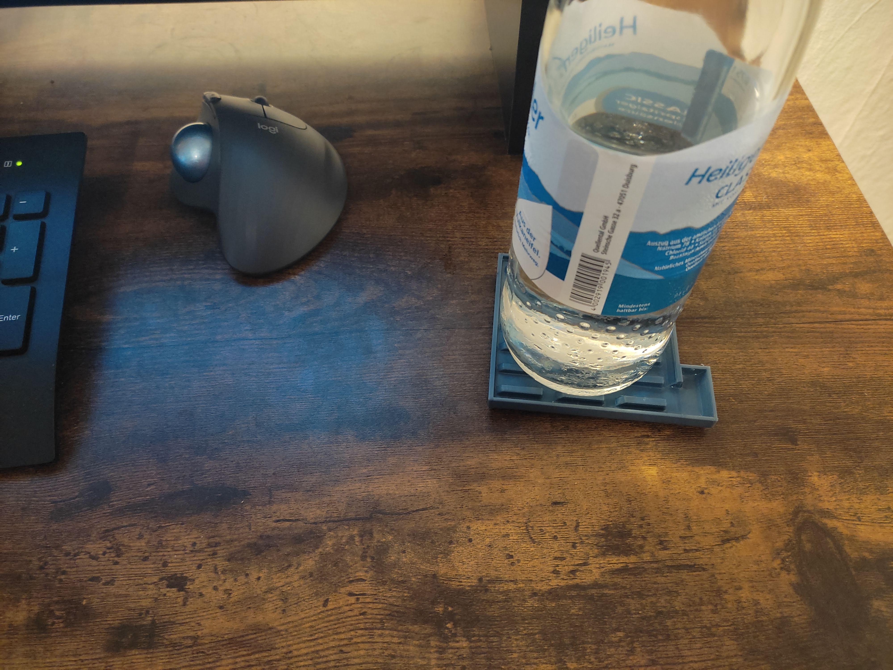
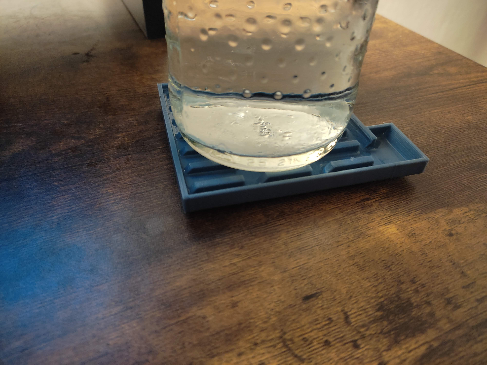
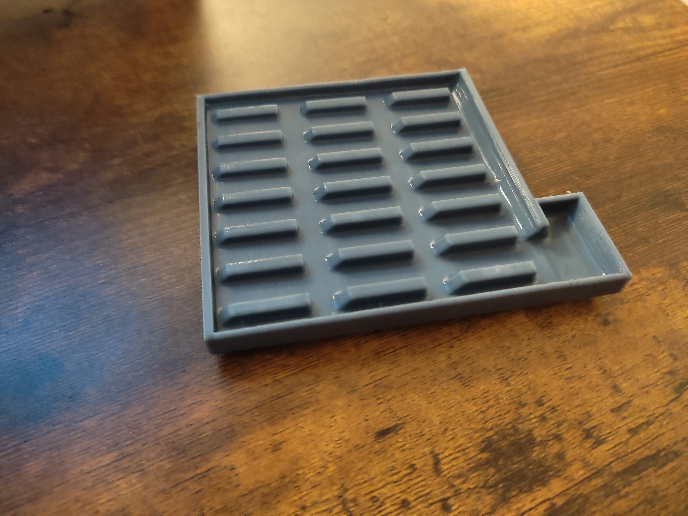
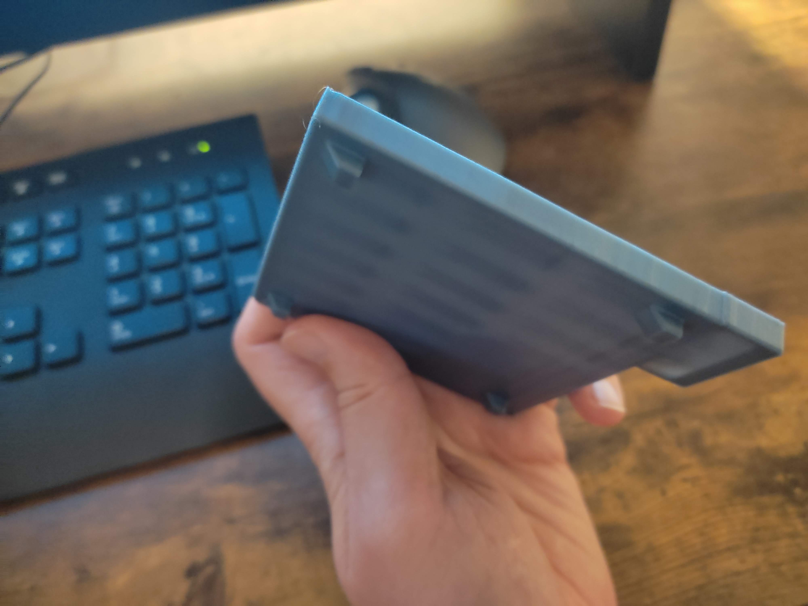
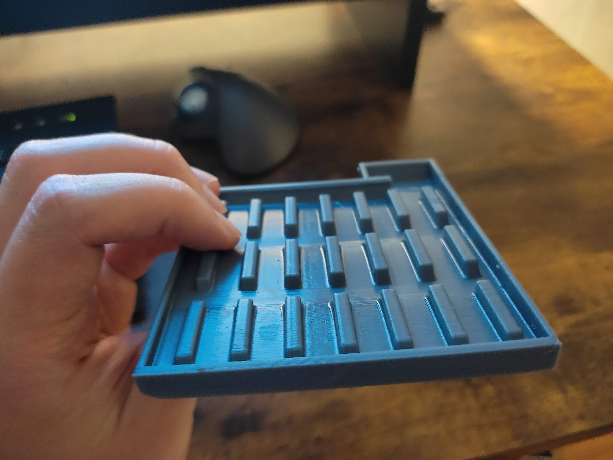
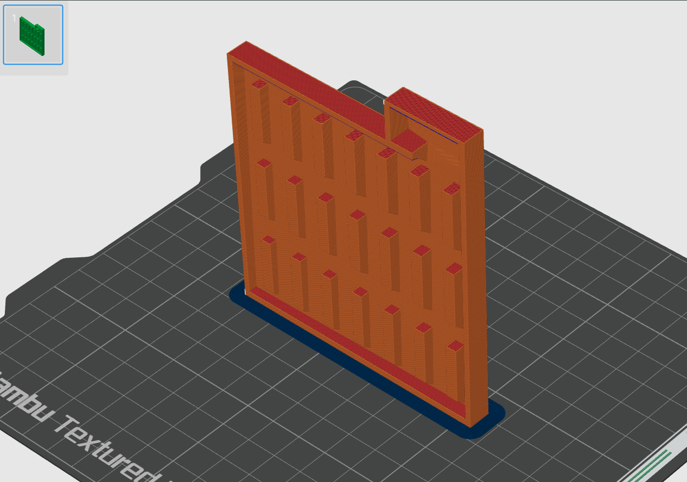
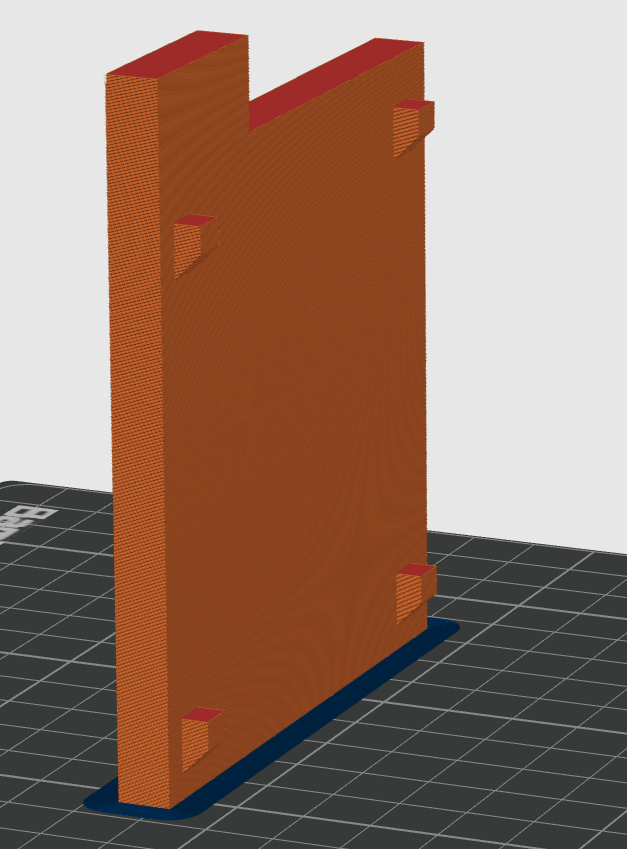

# Heavy Duty Bottle Coaster

On hot days, cold water bottles sweat a lot. I could not find a good big coaster to protect my table. So I made this.

<table>
<tr>
    <td></td>
    <td></td>
    <td></td>
</tr>
<tr>
    <td></td>
    <td></td>
</tr>
</table>

## 3D Print

Put the .stl into your slicer like this

<table>
<tr>
    <td></td>
    <td></td>
</tr>
</table>
